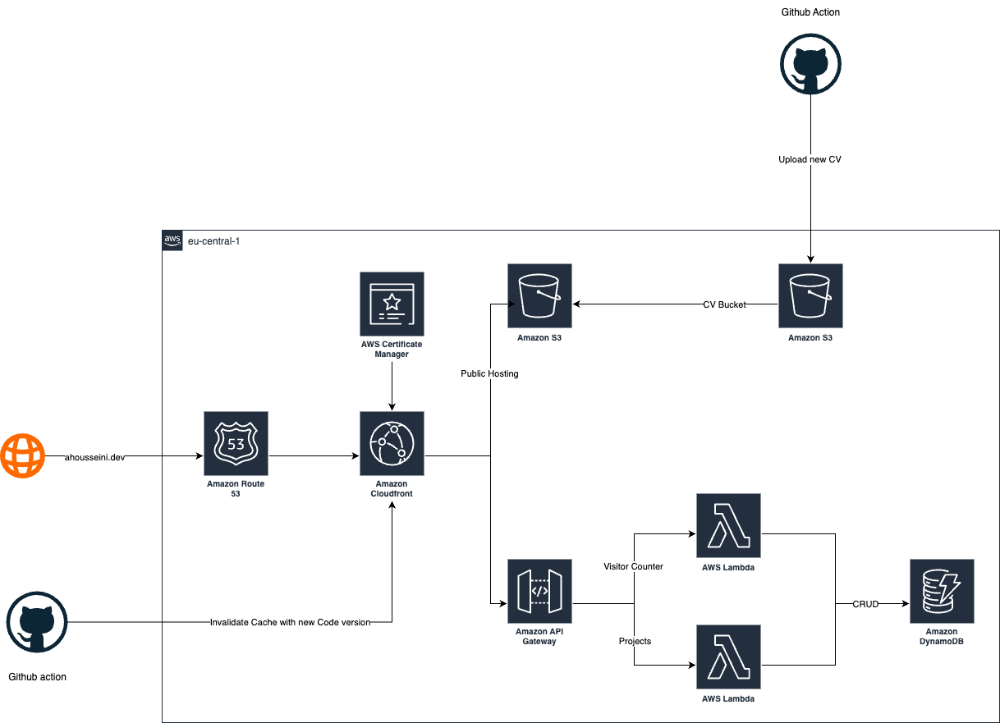

# Web Infrastructure – Personal Portfolio Architecture

This project defines the cloud infrastructure for my personal website hosting, built entirely on AWS using a serverless architecture.

---

## 🗺️ Architecture Diagram

## 🌐 Domain

- **Domain**: `ahousseini.dev` (registered via GoDaddy)
- **DNS**: Managed using **Amazon Route 53**
- **TLS**: Certificate provisioned via **AWS Certificate Manager (ACM)** and attached to CloudFront

---

## 🗂️ Static Hosting

- **Frontend**: HTML/CSS static website hosted on **Amazon S3**
- **CV Hosting**: Stored in a separate S3 bucket; updated automatically via GitHub Actions

---

## 🚀 Content Delivery

- **Amazon CloudFront**:
  - Serves both the portfolio and CV securely over HTTPS
  - Distributes content globally with low latency
  - Caches responses; invalidated on new deployments via GitHub Action

---

## ⚙️ Backend APIs

- **Amazon API Gateway** handles API requests from the frontend
- **AWS Lambda**:
  - One function tracks **visitor counts**
  - Another manages **CRUD operations** for project listings
- **Amazon DynamoDB** is used for persistent storage of analytics and project data

---

## 🔄 Automation

- **GitHub Actions**:
  - On push, the updated CV is uploaded to the CV S3 bucket
  - Triggers CloudFront cache invalidation to reflect the new content

---

## 📌 Region

- All AWS resources are deployed in **eu-central-1 (Frankfurt)**  
  *(except ACM for CloudFront, which requires us-east-1)*

---

## 🧱 Summary

This setup provides:

- A scalable, low-maintenance, and secure web presence
- Instant content updates through GitHub CI/CD
- Real-time backend functionality without server management

